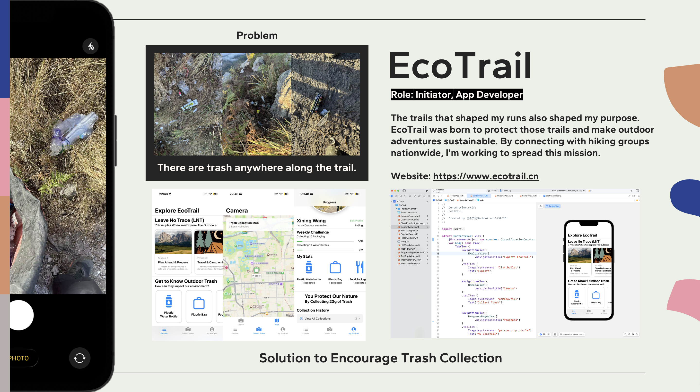

# EcoTrail - Leave No Trace Companion

[](https://swift.org)
[](https://developer.apple.com/ios/)
[](LICENSE)





An AI-powered mobile companion that helps outdoor enthusiasts identify and collect trail trash during adventures.

## 🌿 Why EcoTrail?
Every year, millions of tons of litter are left on hiking trails worldwide. EcoTrail combines computer vision with outdoor activism to:
- Make trash collection part of your outdoor routine
- Educate users about proper waste disposal
- Build a community of environmentally conscious adventurers

## ✨ Key Features
| Feature | Description |
|---------|-------------|
| 🗑️ **Smart Detection** | Real-time trash identification using `TinyObjectDetector.mlmodel` |
| 🏔️ **Trail Challenges** | Join community clean-up events in `Explore` module |
| 📊 **Impact Tracking** | Visualize your collected trash in `Progress` dashboard |
| 🏆 **Gamification** | Earn badges for different trash types (plastics, metals, etc.) |

## 🚀 Getting Started

### Prerequisites
- iOS 17.0+
- Xcode 15+
- iPhone with A12 Bionic chip or later (for optimal ML performance)

### Installation
```bash
git clone https://github.com/yourusername/EcoTrail.git
cd EcoTrail
open EcoTrail.xcodeproj
```
### How It Works
Capture: Point your camera at trail trash

Identify: AI classifies waste type and disposal method

Log: Record your cleanup with GPS tagging

Share: Post to community feed via TrailCardView

### 🛠️ Technical Stack
Core ML for on-device trash detection

SwiftUI for declarative UI

MapKit for trail mapping

CloudKit for community features

### 📸 UI Preview
Camera View	Classification	Community Feed
		
### 🤝 Contributing
We welcome contributions from:

Outdoor enthusiasts

ML engineers (model optimization)

UI/UX designers

Translators (currently EN/CN only)

See our Contribution Guidelines for details.

### 📜 License
Distributed under the MIT License. See LICENSE for more information.
